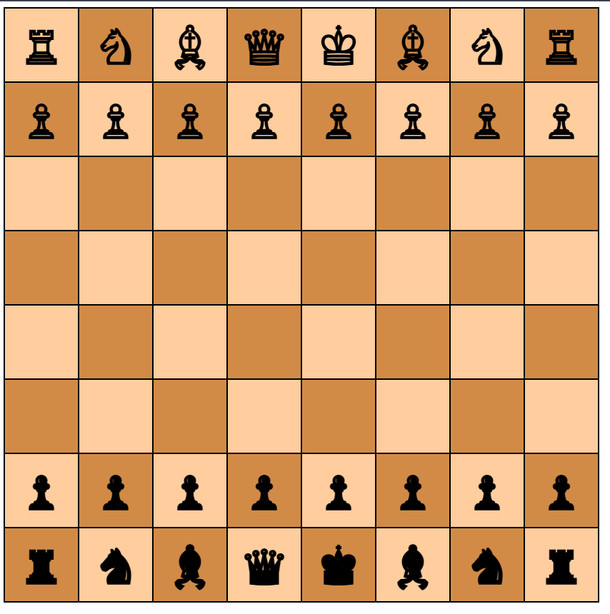

# Introduction                                  
HTML, an acro of Hyper text markup languange, is a language created to make websites!                          
It is very widely used and is nowadays common to see websites built with HTML.                          
Now to be precise, HTML alone is not enough to create webpages!                          
We will need two more languages to build a complete webpage.                          
That is, CSS and JavaScript!                          
                      
Think of HTML as a skeleton of a house, you write the base content of a webpage in HTML.                          
Now CSS, an acro os Cascading Style Sheet, is like a styling of a house with so many colors.                          
With CSS you can style your webpage to make it look like however you want.                          
With JavaScript, you decide the functionality of your webpage!                          
If you are willing to make a website that is static and does not change dynamically, HTML and CSS alone is enough.                          
But, if you want to make functional webpages such as Games or Calendar, you will need JavaScript too.                          
                      
                      
Now if you want to get started in HTML CSS and JS,                      
The good news is that you dont need to install anything except a browser to do this.                      
You can just open the HTML file in your browser and see the result.                      
                      
## Tags                      
Let us take a look at a sample HTML code with no CSS or JavaScript involved:                           
```                      
<!DOCTYPE html>                          
<html lang="en">                          
    <head>                          
        <meta charset="UTF-8">                          
        <meta name="viewport" content="width=device-width, initial-scale=1">                          
        <title>My website</title>                          
    </head>                          
    <body>                          
        <p>Hello!</p>                          
    </body>                          
</html>                          
```                
If you are used to using XML frequently, you might find these familiar.                    
See these "<>" syntaxes with text inside them? Those are called "Tags" in HTML.                    
Tags are used to display different kinds of content.                    
Below is the syntax of all tags in html:                   
```                
<tagname attributes></tagname>                
```                
We should replace "tagname" with a real tag name and "attributes" with real attributes while coding.                   
We will talk about attributes later. The first set of "<>" is called the opening tag.                       
And opening tag lets HTML know that we have initiated a tag, here is where whe pass all our arguments, too.                    
Now the second set of "<>" is called the closing tag. It lets HTML Know that we have ended a tag.                      
Note that when using a tag, the opening and closing tag should always have the same name.                        
For example, the first one on the below is wrong and the second one is correct:                       
```                   
<mytag1></mytag2>❌                  
<mytag1></mytag1>✅                     
```                       
There are many tags in HTML, but here we will be talking about the following:                         
- html tag            
- head tag             
- title tag            
- meta tag            
- body tag            
- h1-h6 tag            
- p tag            
            
But before covering these tags right away, we need to talk about the "<!DOCTYPE html>".            
You may have noticed this line on the very top of our previous example.            
This line is a must for all HTML files. It lets HTML know that we are initiating a HTML file.            
Although our HTML file will work without this line, it is Very strongly recommended to put this line on top.            
Knowing this, let us jump to the tags.            
            
## html tag            
This tag is the tag that initiates us HTML code. All of our code should be inside this tag.            
Below is an example of the HTML tag:            
```            
<!DOCTYPE html>            
<html>            
</html>            
```            
We will be writing our code within the opening and the closing html tag.            
            
            
## head tag            
This tag has to be used inside the html tag and it is used to define some metadata and info about the page.            
We can set things such as the title, metadata, and some css stylings in here.            
Here is an example of the head tag:            
```            
<!DOCTYPE html>            
<html>            
    <head>            
    </head>            
</html>            
```            
We will be writing our metadata inside the head tag.            
Search engines and Web browsers will rank our website on the search results based on these metadata.            
            
## title tag            
As the name suggests, we define the title of our website in this tag.            
This tag is to be used inside the head tag as this is some metadata.            
Below is an example of the Title tag:            
```            
<!DOCTYPE html>            
<html>            
    <head>            
        <title>Some title</title>            
    </head>            
</html>            
```            
In this example, "Some title" will be the title of our webpage.            
But we can replace it with whatever we want.            
            
## meta tag            
This tag is the tag that is used to define some metadata about our webpage.            
As you might have guessed, it is to be used inside the Head tag.            
Below is an example:            
```            
<!DOCTYPE html>            
<html>            
    <head>            
        <meta charset="utf-8">            
    	<meta name="viewport" content="width=device-width, initial-scale=1">            
        <title>Some title</title>            
    </head>            
</html>            
```            
Now in most websites that we make, it is not required to use the meta tag unless you need to.            
But the about two meta tags are very strongly recommened to be used in all of your webpages.            
This is because, if you dont include these meta tags, in some devices your website may not look very good.            
            
## body tag            
This tag is the starting point of your main code.            
Here is where you put all the content you want.            
For example:            
```            
<!DOCTYPE html>            
<html>            
    <head>            
        <meta charset="utf-8">            
    	<meta name="viewport" content="width=device-width, initial-scale=1">            
        <title>Some title</title>            
    </head>            
    <body>            
    </body>            
</html>            
```            
All of our code which is visible in the output of the webpage goes within the opening and the closing body tag.            
            
            
## h1-h6 tag            
These tags are used to display headings of different sizes.            
In these tags,            
- h1 is the biggest            
- h2 is little bit smaller than             
- h3 is smaller than h2             
- h4 is smaller than h3             
- h5 is just a little bit bigger than the smallest            
- h6 is the smallest            
            
Below is an example:            
```            
<!DOCTYPE html>            
<html>            
    <head>            
        <meta charset="utf-8">            
    	<meta name="viewport" content="width=device-width, initial-scale=1">            
        <title>Some title</title>            
    </head>            
    <body>            
        <h1>h1</h1>            
        <h2>h2</h1>            
        <h3>h3</h1>            
        <h4>h4</h1>            
        <h5>h5</h1>            
        <h6>h6</h1>            
    </body>            
</html>            
```            
            
To see the result of this program for yourself, just copy the output of this program and put it in a HTML file.            
Then open that HTML file in your browser to see the result.            
Once you open the file in your browser, you will notice that there will be headings ranked from the biggest to the smallest.            
            
            
## p tag            
This tag is pretty similar to the heading tags, but except these tags are intended for normal paragraphs.            
Below is an example:            
```            
<!DOCTYPE html>            
<html>            
    <head>            
        <meta charset="utf-8">            
    	<meta name="viewport" content="width=device-width, initial-scale=1">            
        <title>Some title</title>            
    </head>            
    <body>            
        <p>This is some normal, paragraph text</p>            
    </body>            
</html>            
```            

# Assignment 1 - Indian Tricolor Flag with Ashoka Chakra    
## 1a 
Build a HTML page showing the [Indian flag](https://kishandharan.github.io/HTML/indianflag.html) with red white green rectangular areas with an image of an ashoka chakra using the tags head, body, style, title, img, div. Use image [ashokachakra.png](https://github.com/Kishandharan/HTML/blob/main/ashokachakra.png). Use class attribute to decorate each rectangular div element with required dimensions. Example width=600px height=150px and required color.
## 1b    
Add an id to ashokachakra image, to make it toggle onclick. Use script tag to write a function that accesses the opacity CSS value and conditionally make it visible or hidden based on a boolean flag showChakra=true/false. Use document.getElementById() method to access the required DOM elements.


# Assignment 2 - Bulb on, Bulb off
## 2a 
Build a HTML page showing a [light bulb in the off state](https://kishandharan.github.io/HTML/bulb_onoff1.html).
When clicked, the bulb should change to on state.
Use images [bulbon.gif](https://github.com/Kishandharan/HTML/blob/main/bulbon.gif) and [bulboff.gif](https://github.com/Kishandharan/HTML/blob/main/bulboff.gif)
Use img src="bulboff.gif" id="bulb_id1" width="200". bulb_id1 will be the id of the image corresponding to the bulb state. 
width="200" can be changed to increase or decrease the size of the image.

## 2b 
Modify the HTML page to show an additional text within the p tag. "Bulb is on" or "Bulb is off".
Use p id="bulb_id2">Bulb is off p. bulb_id2 will be the id of the text corresponding to the bulb state.

# Assignment 3 - Calendar 2025
## 3a 
Build a HTML page showing the calendar for [Jan 2025](https://kishandharan.github.io/HTML/calendar1.html).
Use table, tr, td tags. To show sunday in red color, add class="red" and include it's properties within style tag as color:red;
Use attributes width, height to adjust the dimensions of td tag and table tag.
Set the background color of the table to black and set the background color of td tag to white to create a border.

## 3b 

# Assignment 4 - Simple Chess Board
## 4a 
Build a HTML page like [this webpage](https://kishandharan.github.io/HTML/chessboard1.html) showing a Simple chess board with colors #d18b47 and #ffcd9e.
Dont add any pieces for now and put a full stop symbol on all the squares.
Use table tag, tr tag and td tag to create the chess board.
Use CSS properties width, height, text-align, font-size, font-weight and background color to style the page.
Optionally, Use :root to define the CSS variables to set different rgb values for each color, namely, color1 and color2.
If you have used CSS variables, use the var function to access the variables.
Use classes color1 and color2 to apply the color for each square.


## 4b 
Now add the appropriate pieces using the unicode values of the chess pieces from [this website](https://www.alt-codes.net/chess-symbols.php).

# Assignment 5 - Simple Countdown timer
## 5a 
Create a Simple timer which counts from 10 to 0 in seconds.
And when in reaches 0, it should stop running.

## 5b 
Now create a timer which Alerts us as "Time up" when the time finishes. 
Use the a p tag to display the alert message.
Take [this website](https://kishandharan.github.io/HTML/timer1.html) as a reference if you want.

# Assignment 6 - Simple Seat Selection
## 6a 
Create a webpage where 30 seat icons are displayed in a 6 columns, 5 rows table.
The first one and the last one in the first row have to be red in color, while the others have to be black.
Dont need for any Selection functionality for now.

## 6b 
Now create the exact same webpage as before but now with some selection functionality.
The user should be able to toggle select one any element, even multiselect.
The selected seats should be green in color while non-selected seats can be in black color.
The user should not be able to select the red seats as we make them occupied.
Take [this website](https://kishandharan.github.io/HTML/seatselection1.html) the reference if you want.
Use the setAttribute and getAttribute document functions in JS to manipulate the seats.
Use an enhanced for loop to get the base functionality working for all the seats.
Add some borders too to make the table more neater.
Above the table, add some color indicators so that customers know which color indicates what.


# Assignment 7 - Password generator
## 7a 
Create a simple password generator which generates password everytime we refresh the webpage in the inspect console.
Create a 3 arrays containing small letters, capital letters, and numbers respectively.
Now pick a random element from all these arrays and add them to a string. And then print them in the console
This generates a simple 3 digit password in the console.

## 7b 
Now create a webpage that displays the output in the UI instead of the console. 
Instead of needing to refresh the webpage everytime we want a new password, create a button that generates a new Password
everytime it has been clicked and shows it in the UI. Create a array that has all the items of all these three arrays.
Now instead of picking random elements from the three arrays, pick 3 random chars from the fourth combined array.
This way the password will be shuffled and will be more secure.

## 7c 
Now make a new version of the previous webpage. Here take two inputs, one specifying the number of passwords to generate,
and the other specifying the length of the password. Add all those passwords to a very nice and neat numbered list.
Use a font from google APIs such as JetBrains Mono font to make the website look much neater.


# Assignment 8 - Colour Palette

## 8a

Generate 8 shades of RED colour and show in a tabular format       
Generate 8 shades of GREEN colour and show it in a tabular format     
Generate 8 shades of BLUE colour and show it in a tabular format   
This can be done to assist in selecting a user to decide        
- which shade of paint to used for his house                       
- which shade of paint to be used for choosing a school uniform          

## 8b                                                                     
Create a HTML form with 3 inputs.                                                    
Enter Value of Red -                                       
Enter Value of Green                                         
Enter Value of Blue                                           
Submit button                                                
It should generate the colour in a big rectangular area                               

## 8c                                                        
For the above form, create validation for each field                              
RED value should be between 0 to 255                                         
GREEN value should be between 0 to 255                                         
BLUE value should be between 0 to 255                                                     


## 8d  
Generate a 16x16 grid to show 256 different colours by varying R, G, B values systematically through 3 nested FOR loops.                                       
This can be done in different ways.                      
For example using a Random number also.                      

## 8e   
If you hover over any colour, it should show the required RGB value.  Insert a Copy button so that it can be pasted in any IDE


# Assignment 9 - Joke Generator 
## 9a 
Create a web page where it shows random jokes. Use the https://icanhazdadjoke.com api to fetch random jokes.
It should display a simple box with a thick black border inside which the joke should be displayed. Use a font like JetBrains Mono to display everything,
so that it looks clean. The joke displayed inside the box should be orange in color.


# Assignment 10 - US presidents
## 10a 
Create a web page where the US presidents images are displayed as a slide show.
Use two buttons with arrows pointing to left and right to go to the previous or the next image respectively.
Round the cornors of the image and the buttons. Make a indicator right above the image saying "President-1", "President-2", "President-3" and so on 
till "President-17" to indicate the current image we are in.
Take [this page](https://kishandharan.github.io/HTML/uspresidents_a1.html) as a reference.
